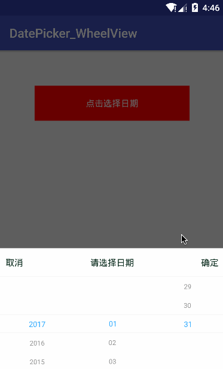

# DatePicker
 

轻量级的日期选择器，使用WheelView
####自定义属性介绍
属性|介绍
-|-
lineColor|分割线颜色
lineHeight|分割线高度
itemNumber|此wheelView显示item的个数
maskHight|蒙版高度（normalText的位置）
noEmpty|设置true则选中不能为空，否则可以是空
normalTextColor|未选中文本颜色
normalTextSize|未选中文本字体大小
selectedTextColor|选中文本颜色
selectedTextSize|选中文本字体大小
unitHight|每个item单元的高度
####API介绍
1. setData(ArrayList data) //设置WheelView的数据
2. resetData(ArrayList data) //重置 WheelView的数据，如果已经设置过的话
3. int getSelected() //获取选中项的index
4. String getSelectedText() //获取选中项的文本信息
5. boolean isScrolling //获取WheelView是否在滚动中
6. boolean isEnable() //获取wheelView是否可用
7. void setEnable(boolean isEnable) //设置WheelView是否可用
8. void setDefault(int index) //设置默认选中项的index
9. int getListSize() //获取WheelView的item项个数
10. String getItemText(int index) //获取index位置上的文本数据
11. void setOnSelectListener(OnSelectListener onSelectListener) //对WheelView设置监听，在 滑动过程 或者 滑动停止 返回数据信息。